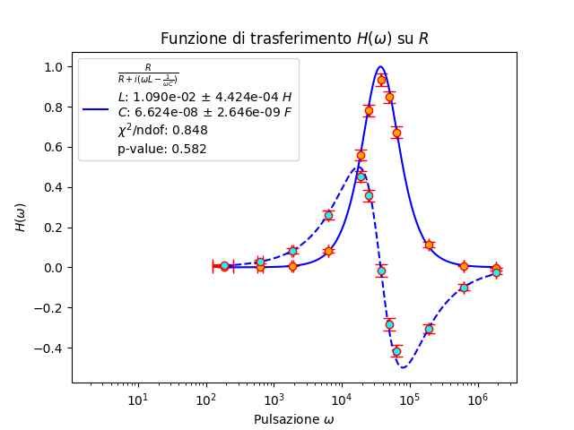

## Fit

### Utilizzo
Lo script viene invocato da riga di comando, e ammette 2 parametri:
```sh
python3 ./fit.py <nome file dati> <nome modello> [parametri extra]
```
Nel caso entrambi i parametri venissero omessi il nome del file dati e il nome del modello verranno richiesti come input.
Inoltre, sono disponibili tre parametri opzionali per alterare il funzionamento dello script.
```sh
-nofit -comp -fase
```
Il parametro `-nofit` rende lo script una semplice utilità di plotting. Nessun fit verrà eseguito, verranno solo mostrati a schermo i dati tramite uno scatter.
Il parametro `-comp` forza la rappresentazione complessa, anche se i dati forniti sono reali. Il parametro `-fase` invece cambia il tipo di file dati accettato, 
e forza la rappresentazione complessa.

Lo script esegue un fit eseguito con il metodo dei minimi quadrati e mostra a schermo gli esiti della procedura di fitting, insieme ad un plot del risultato.
### File dati
Il file dati può avere due formati in funzione dell'utilizzo del parametro `-fase`. In entrambi i casi il file è costituito da una lista, separata da spazi o da tab.

Nel caso in cui il parametro `-fase` non fosse presente la struttura per le righe è la seguente:
```sh
<valore X> <valore Y> <errore X> <errore Y>
```
I valori `<valore Y>` e `<errore Y>` possono essere complessi, con la forma `"a+bi"`. Non devono essere presenti spazi tra `a,b,+` nel caso questo metodo venisse utilizzato.

Nel caso in cui il parametro `-fase` è utilizzato, la struttura diventa la seguente:
```sh
<valore X> <ampiezza Y> <fase Y> <errore X> <errore ampiezza> <errore fase>
```
In questo caso tutti i valori devono essere reali per il corretto funzionamento dello script.

### Modello
Il modello viene descritto in un modulo python, che deve trovarsi nella stessa cartella dello script. Nel caso il file si chiamasse `modello.py` bisognerà invocare lo
script con `python3 ./fit.py  <nome file dati> modello [parametri extra]`. Il modulo deve contenere 4 oggetti:
1. Il modello vero e proprio:
   ```python
   def modello(x, *parametri):
     ...
   ```
   La funzione deve essere compatibile con numpy per il corretto funzionamento dello script, ed è necessario che la segnatura sia quella descritta sopra. Nel caso    si stia usando dati complessi è possibile renderla una funzione complessa (in python i numeri complessi si scrivono come `a+bj`). 
2. La derivata del modello:
   ```python
   def derivata_modello(x, *parametri):
     ...
   ```
   Come sopra, deve essere compatibile con numpy, e può essere complessa. Nel caso non si volesse usare la propagazione d'errore per considerare l'errore su $x$ sarà sufficiente utilizzare la seguente:
   ```python
   def derivata_modello(x, *parametri):
     return np.zeros_like(x)
   ```
3. Un dizionario di configurazione:
   ```python
   configurazione = {
     "iniziali": {...},
     "limiti": {...},
     "fissati": {...},
   }
   ```
   La chiave `iniziali` deve essere **sempre presente**. Va associata ad un dizionario le cui chiavi sono **tutti** i nomi dei parametri (sotto forma di stringa), e i cui valori sono il valore iniziale che il parametro deve prendere per iniziare il fit.

   La chiave `limiti` associa ad ogni parametro una tupla `(a,b)` contenente il dominio per il parametro. Ad esempio, se un parametro `param` dovrà essere sempre positivo:
   ```python
   "limiti": {"param": (0, None)},
   ```
   La chiave `fissati` invece associa ad ogni parametro un valore booleano `True,False` che decide quali parametri mantenere fissi per il fit.
4. Un dizionario di descrizione:
   ```python
   descrizione = {
     "titolo" : stringa_titolo,
     "equazione": stringa_equazione,
     "scala_x": stringa_scala_x,
     "scala_y": stringa_scala_y,
     "nomi": {...},
     "misure": {...}
   }
   ```
   `stringa_titolo` deve essere una stringa (possibilmente anche LaTeX) contentente il titolo del fit.

   `equazione` è l'equazione che descrive il modello, sempre in LaTeX.
   
   `stringa_scala_x/y` può contenere la scala per l'asse $x$ o $y$, che è una stringa di scala compatibile con matplotlib (`"log"`,`"linear"`,...).

   `nomi` ha associato un dizionario
   che associa ad ogni parametro il modo in cui verrà renderizzato a schermo, come stringa anche LaTeX. Ad esempio, se `theta` è un parametro del modello, si potrebbe usare `"theta": r"$\theta$"` nel dizionario nomi
   per renderizzare il simbolo per theta piuttosto che il testo. Inoltre, nel dizionario per `nomi` sono disponibili le chiavi `"asse_x"` e `"asse_y"`, il cui valore sarà la label
   associata a ciascun asse. Ad esempio `"asse_x": r"Pulsazione $\omega$", "asse_y": r"Funzione di trasferimento $H(\omega)$"`.

   `misure` ha associato un dizionario che dettaglia le unità di misura per ciascuna quantità. Ad esempio, se il parametro `k` del modello è misurato in Volt, si potrà inserire una coppia
   `"k": "V"` nel dizionario associato a `misure`. Le chiavi `asse_x/y` sono disponibili anche per questo dizionario.
